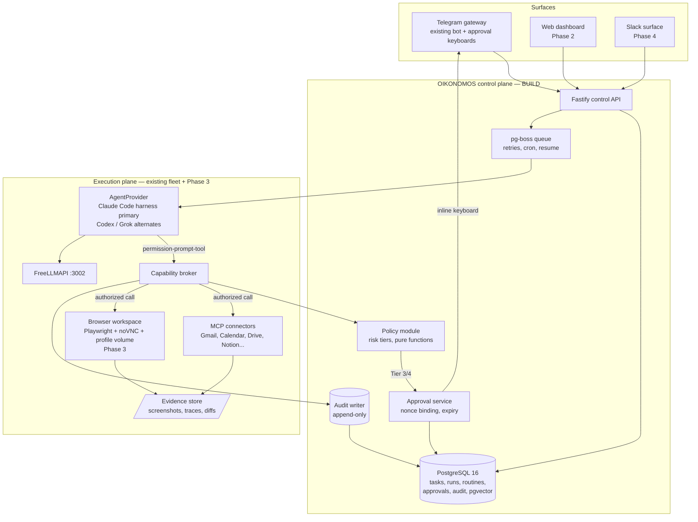

# OIKONOMOS — AI Teammate Platform Synthesis Specification

**Version:** 0.1
**Date:** 2026-08-13
**Owner:** Alister Witbooi, Basileia Technologies
**Status:** DESIGN — Phase 0 implementation-ready
**Codename rationale:** οἰκονόμος — the faithful and wise steward (Luke 12:42). Basileia builds the kingdom; OIKONOMOS stewards its work.

---

## 1. Executive position

The upstream research document ("Building an AI Teammate Platform: Open-Source-Oriented Reference Architecture") is a correct answer to the wrong question. It specifies how a *vendor* would ship a multi-tenant Grok-Bot/Cowork competitor. Basileia's actual position is different: **the execution plane already exists and is in production** (clawsrv, OpenClaw, PM2, Tailscale, FreeLLMAPI, cc-multi-agent-telegram-bot with the AgentProvider abstraction, MT5 relay). The genuine gap — and the genuine product moat — is the **control plane**:

1. Durable, resumable task/run state independent of chat history
2. Risk-tiered action policy enforced **outside the model**
3. Cryptographically-bound approvals (exact-action binding, nonce, expiry)
4. A capability broker between every agent and every tool
5. Append-only audit with evidence artifacts
6. An isolated, persistent browser workspace with human takeover

None of the three candidate systems (OpenWorker, Hermes Agent, Claude Code harness) provides items 1–5 as a hard boundary. All three provide pieces of everything else. OIKONOMOS is therefore defined as:

> **OIKONOMOS = existing Basileia execution fleet + Hermes-pattern learning/gateway layer + a new control plane (built) + browser workspace (built) — with the Claude Code harness as the primary agent brain via the existing AgentProvider interface.**

### 1.1 Decisions ratified from the research document

| # | Decision | Status |
|---|---|---|
| D1 | Browser-first, single-agent-per-workspace, approval-gated, durable | **KEEP** |
| D2 | Risk tiers 0–4 with Tier-3 just-in-time approval, Tier-4 deny-by-default | **KEEP** (core of Phase 0) |
| D3 | Approval object binds exact action: tenant, run, destination, rendered diff, expiry, one-time nonce; any field change invalidates | **KEEP** (core of Phase 0) |
| D4 | Capability broker; planner never receives raw browser/mail/db/credential access | **KEEP** (core of Phase 0) |
| D5 | Routine extraction, not model training, for "learning by demonstration" | **KEEP** (Phase 4; Hermes skills cover 80%) |
| D6 | Memory split into run state / profile / routine knowledge / retrieval / episodic evidence | **KEEP** |
| D7 | "What not to build first" list (no custom CU model, no unrestricted autonomy, no desktop fleet, no autonomous send, no memory-of-everything, no native mobile execution) | **KEEP** verbatim |

### 1.2 Decisions overridden

| # | Research doc says | OIKONOMOS decision | Rationale |
|---|---|---|---|
| O1 | Stage 0 includes Keycloak/OIDC SSO and multi-tenancy | **Single-tenant, schema-ready.** Every table carries `tenant_id` (default `'basileia'`), every broker check filters on it, but no IdP is deployed. Auth = Tailscale network boundary + Telegram user allowlist + per-service tokens. | First users are Alister + Basileia. Keycloak is 2–4 weeks of ops for zero current users. The schema decision (tenant_id everywhere) is the irreversible part; the IdP is swappable later. |
| O2 | Agent runtime = "custom tool-calling loop with LangGraph; optionally OpenHands pieces" | **Claude Code harness (Agent SDK) as primary runtime, invoked through the existing AgentProvider interface** (Claude Code / Codex CLI / Grok Build). LangGraph rejected. | The harness is the production-hardened engine behind Claude Cowork: durable loop, permission hooks (`--permission-prompt-tool`), MCP, skills, subagents, session resume. Basileia already owns a tested (88 Vitest tests) provider abstraction over it. Rebuilding a planner in LangGraph discards that asset. |
| O3 | Temporal as Stage-2 durable orchestrator | **pg-boss (PostgreSQL-backed job queue, TypeScript-native) for Phases 0–3; Temporal adoption gate at Phase 4** if (a) >1 worker host, or (b) approval waits regularly exceed 72h, or (c) workflow definitions exceed what a state-machine table can express. | Temporal on a single VPS is ~1.5 GB RAM + operational surface (server, UI, workers, versioning discipline) for durability that Postgres + idempotent state transitions already provide at this scale. The doc's own principle — minimize irreversible decisions — favors pg-boss first: the task state machine lives in Postgres either way, so migration is a worker rewrite, not a data migration. |
| O4 | OpenBao at Stage 0 | **Phase 0: systemd credentials + age-encrypted secrets file, per-service scoping. OpenBao at Phase 3** when the browser workspace introduces OAuth token leasing and per-workspace session keys — the first moment leasing/revocation semantics are actually exercised. | Deploying a secrets manager before any secret needs a lease is ceremony. The non-negotiable Phase-0 rule is retained: **no credentials in prompts, logs, or model-visible context, ever.** |
| O5 | OPA/Cedar policy engine | **Typed TypeScript policy module inside the capability broker for Phases 0–3** (versioned in Git, unit-tested, pure functions). OPA adoption gate: when policies must be edited by non-engineers or differ per tenant. | The doc is right that policy must live outside the model. It does not follow that it must live outside the codebase. A pure-function policy module is testable, reviewable, and auditable — and 50× simpler to operate. |
| O6 | React/Next.js product UI at Stage 0 | **Telegram is the Phase 0–1 UI** (task intake, run status, approval inline-keyboards, evidence photos). Web dashboard (React, reusing VANTAGE canvas-dashboard patterns) at Phase 2. | The Telegram bot exists, is production-ready, and is already the fleet's command surface. Approvals-as-inline-keyboards is a shippable approval inbox this week. |
| O7 | ChromaDB (current fleet) + separate stores | **Consolidate on PostgreSQL + pgvector** for profile facts, routine knowledge, and retrieval. ChromaDB remains only inside VANTAGE until its migration ticket. | One authoritative store where ACL filtering happens *before* similarity search (doc §Memory is correct on this). Two vector stores is one too many. |

---

## 2. Asset inventory — what Basileia already owns, mapped to the target

| Target capability | Existing Basileia asset | Reuse mode | Gap remaining |
|---|---|---|---|
| "Own computer" / 24-7 host | clawsrv (Ubuntu 24.04 VPS), Tailscale, PM2 | Direct | Per-agent isolation (Docker) — Phase 3 |
| Agent brain | AgentProvider interface (Claude Code, Codex CLI, Grok Build) in cc-multi-agent-telegram-bot; 88 passing tests | Direct — extract into `@basileia/agent-providers` package | Permission-prompt-tool wiring to broker |
| Multi-platform command surface | cc-multi-agent-telegram-bot (grammy, streaming, session persistence, cron) | Direct — becomes the OIKONOMOS gateway | Approval inline-keyboard flow (Phase 0) |
| Model gateway / routing | FreeLLMAPI on port 3002 under PM2 | Direct | Budget policy per routine (Phase 2) |
| Scheduling | Bot cron scheduling; Hermes cron patterns | Direct + harvest | Durable run linkage (Phase 2) |
| Windows-side bridge | MT5 relay pattern (Flask, 8090, Tailscale) | Pattern reuse for any future Windows-app automation | — |
| Notification/evidence delivery | Telegram notifier patterns (VANTAGE) | Direct | — |
| Memory infra | ChromaDB (VANTAGE), SQLite session stores | Migrate → pgvector | Postgres deployment (Phase 0) |
| Audit discipline | Fable adversarial-review process, Conventional Commits | Process reuse | Append-only audit table (Phase 0) |

**Consequence:** the research doc's Stages 0–2 shrink from an estimated 8–12 engineer-weeks to roughly 3–4, because the UI, gateway, agent runtime, scheduler, host, and network layer are pre-existing production assets.

---

## 3. Component sourcing matrix

Legend — **ADOPT**: run it. **HARVEST**: read the subsystem, re-implement the pattern. **BUILD**: original OIKONOMOS code. **DEFER**: explicitly not now.

| Layer | Source | Mode | Specifics |
|---|---|---|---|
| Agent loop, tools, MCP, skills, subagents, session resume | **Claude Code harness / Agent SDK** | ADOPT | Invoked via AgentProvider. Use `--permission-prompt-tool` (or SDK `canUseTool` callback) to route every tool request through the OIKONOMOS capability broker — this is the single most important integration point in the platform. |
| Provider abstraction | **cc-multi-agent-telegram-bot** | ADOPT | Extract `AgentProvider` into a standalone package; Codex and Grok Build remain drop-in alternates for cost/redundancy routing. |
| Learning loop (skill creation from experience, in-use skill self-improvement, memory nudges, FTS5 cross-session search, Honcho user modeling) | **Hermes Agent** (`skills/`, `hermes_state_search.py`, memory docs) | HARVEST | This is the "learns by demonstration / remembers how I work" pillar. Hermes's mechanism — agent-curated Markdown skills compatible with the agentskills.io standard — composes directly with Claude Code skills. Harvest the *curation triggers* (post-task skill proposal, periodic persistence nudges), not the code. |
| Multi-platform gateway patterns (Telegram/Discord/Slack/WhatsApp/Signal from one process; cross-platform conversation continuity; DM pairing security) | **Hermes** (`gateway/`) | HARVEST | Basileia's bot is Telegram-only; harvest the platform-adapter seam so Slack (Basileia workspace) can be added without a rewrite. |
| Cron with platform delivery in natural language | **Hermes** (`cron/`) | HARVEST | Pattern: schedule stored as structured object + NL description; delivery target is a platform address, not a hardcoded chat. |
| Serverless-hibernating agent environments | **Hermes** (Daytona/Modal terminal backends) | DEFER | Relevant only if clawsrv economics fail. Note the pattern exists; do not build. |
| Approval-inbox UX ("unattended runs park their asks in an inbox instead of acting"; per-tool enable/disable; consequential-action check-ins) | **OpenWorker** (`coworker/` engine, approval flow) | HARVEST | The UX contract, not the code: every parked ask carries the evidence needed to decide. Maps to Telegram inline-keyboard approvals in Phase 0 and the web approval inbox in Phase 2. |
| Connector layer reference (25+ integrations: Gmail, Google Calendar, Outlook, Slack, Jira, Notion, Linear, HubSpot, monday.com; OAuth-broker sidecar) | **OpenWorker** (connectors, built on aisuite) | HARVEST | MCP-first is the OIKONOMOS rule; OpenWorker connectors are the reference implementation for scope-minimal OAuth and per-tool control. Its tiny cloud OAuth-broker is the pattern for the Phase 3 "Connect account" flow. |
| Slack-thread session surface (mention bot → session opens on workspace → answer returns as thread reply) | **OpenWorker** | HARVEST | Phase 4, for Basileia client-facing deployments. |
| Durable job queue | **pg-boss** | ADOPT | See O3. Retry policies, cron, singleton jobs, archival — all in Postgres. |
| Browser automation | **Playwright** (persistent context + CDP + traces) | ADOPT | Phase 3. Trace ZIPs become audit evidence artifacts. |
| Remote view/takeover | **noVNC** in the workspace container | ADOPT | Phase 3. Guacamole DEFERRED until RDP/SSH targets exist. |
| Secrets | age + systemd credentials → **OpenBao** | ADOPT (staged) | See O4. |
| Vector + relational memory | **PostgreSQL 16 + pgvector** | ADOPT | Phase 0 deployment; ACL-filter-before-similarity is a hard rule. |
| Object/evidence storage | Filesystem (`/srv/oikonomos/evidence`, encrypted volume) → **MinIO** | ADOPT (staged) | MinIO at Phase 3 when screenshots/traces multiply. |
| Observability | PM2 + structured JSON logs → OpenTelemetry+Grafana | ADOPT (staged) | Grafana stack exists in ORACLE design; reuse it at Phase 2. |
| Control plane API, capability broker, policy module, approval service, audit writer | — | **BUILD** | TypeScript/Node (matches bot stack), Fastify, Zod schemas, Vitest. This is OIKONOMOS proper. Sections 5–7. |
| Browser workspace image + lifecycle | — | **BUILD** | Phase 3. Docker image: Chromium + Playwright + noVNC + profile volume; golden-image rebuild discipline per research doc. |
| Custom computer-use model, unrestricted multi-agent autonomy, desktop VM fleet, autonomous send/payment, memory-of-everything, mobile-native execution | — | **DEFER** | Research doc §"What not to build first", adopted verbatim. |

---

## 4. Target architecture



**The load-bearing wall:** every tool invocation the Claude Code harness attempts flows through `--permission-prompt-tool` into the capability broker. The broker consults the policy module; Tier 0–1 pass; Tier 2 passes only under a role's standing policy; Tier 3 blocks until an approval object is granted; Tier 4 is denied. The model never learns the broker's internals and cannot construct an approval. Prompt-injected content can *ask* for anything; it cannot *authorize* anything — authorization lives in Postgres, not in the context window.

---

## 5. Phase 0 — control plane skeleton (target: 1 week)

**Exit criterion (from research doc, adopted):** a manually triggered Tier-3 action cannot execute without a bound, unexpired, unconsumed approval — proven by tests, including replay and mutation attempts.

### 5.1 PostgreSQL schema (DDL, runnable)

```sql
-- oikonomos schema v0.1 — PostgreSQL 16
CREATE EXTENSION IF NOT EXISTS vector;
CREATE EXTENSION IF NOT EXISTS pgcrypto;

CREATE TYPE task_status  AS ENUM ('draft','queued','running','waiting_approval','paused','completed','failed','cancelled');
CREATE TYPE run_status   AS ENUM ('started','waiting_approval','resumed','completed','failed','cancelled');
CREATE TYPE risk_tier    AS ENUM ('T0_observe','T1_draft','T2_internal','T3_external','T4_irreversible');
CREATE TYPE approval_status AS ENUM ('pending','granted','rejected','expired','invalidated','consumed');

CREATE TABLE tasks (
    task_id      uuid PRIMARY KEY DEFAULT gen_random_uuid(),
    tenant_id    text NOT NULL DEFAULT 'basileia',
    role_id      text NOT NULL,                    -- e.g. 'inbox-triage'
    title        text NOT NULL,
    goal         text NOT NULL,                    -- user-stated outcome
    status       task_status NOT NULL DEFAULT 'draft',
    routine_id   uuid,                             -- nullable: ad-hoc tasks
    requested_by text NOT NULL,                    -- telegram user id / principal
    created_at   timestamptz NOT NULL DEFAULT now(),
    updated_at   timestamptz NOT NULL DEFAULT now()
);

CREATE TABLE runs (
    run_id       uuid PRIMARY KEY DEFAULT gen_random_uuid(),
    task_id      uuid NOT NULL REFERENCES tasks(task_id),
    tenant_id    text NOT NULL DEFAULT 'basileia',
    provider     text NOT NULL,                    -- 'claude-code' | 'codex' | 'grok-build'
    session_ref  text,                             -- harness session id for resume
    status       run_status NOT NULL DEFAULT 'started',
    started_at   timestamptz NOT NULL DEFAULT now(),
    ended_at     timestamptz,
    failure_note text
);

CREATE TABLE capabilities (
    capability_id text PRIMARY KEY,                -- 'email.create_draft'
    description   text NOT NULL,
    default_tier  risk_tier NOT NULL,
    adapter       text NOT NULL,                   -- 'mcp:gmail' | 'browser' | 'fs'
    enabled       boolean NOT NULL DEFAULT true
);

CREATE TABLE role_grants (                         -- which role may request which capability
    role_id       text NOT NULL,
    capability_id text NOT NULL REFERENCES capabilities(capability_id),
    max_tier      risk_tier NOT NULL,              -- role ceiling; broker takes min(default, ceiling)
    constraints   jsonb NOT NULL DEFAULT '{}',     -- e.g. {"domains":["glacier.co.za"],"rate_per_hour":20}
    PRIMARY KEY (role_id, capability_id)
);

CREATE TABLE approvals (
    approval_id   uuid PRIMARY KEY DEFAULT gen_random_uuid(),
    tenant_id     text NOT NULL DEFAULT 'basileia',
    run_id        uuid NOT NULL REFERENCES runs(run_id),
    capability_id text NOT NULL REFERENCES capabilities(capability_id),
    -- exact-action binding (research doc D3):
    action_digest bytea NOT NULL,                  -- sha256(canonical_json(action_payload))
    action_render text NOT NULL,                   -- human-readable: destination + content/param diff
    destination   text NOT NULL,                   -- e.g. recipient address, URL, record id
    nonce         uuid NOT NULL DEFAULT gen_random_uuid(),
    status        approval_status NOT NULL DEFAULT 'pending',
    requested_at  timestamptz NOT NULL DEFAULT now(),
    expires_at    timestamptz NOT NULL,            -- default now()+interval '4 hours'
    decided_by    text,
    decided_at    timestamptz,
    consumed_at   timestamptz,                     -- one-time use; set exactly once
    UNIQUE (nonce)
);

CREATE TABLE audit_events (
    event_id    bigint GENERATED ALWAYS AS IDENTITY PRIMARY KEY,
    tenant_id   text NOT NULL DEFAULT 'basileia',
    run_id      uuid,
    at          timestamptz NOT NULL DEFAULT now(),
    actor       text NOT NULL,                     -- 'agent:claude-code' | 'user:<id>' | 'broker' | 'policy'
    event_type  text NOT NULL,                     -- 'plan','tool.request','policy.decision','approval.granted',...
    capability  text,
    tier        risk_tier,
    payload     jsonb NOT NULL DEFAULT '{}',       -- redacted; never secrets, never full page content
    evidence_uri text                              -- screenshot / trace / diff artifact
);
-- Append-only enforcement:
CREATE RULE audit_no_update AS ON UPDATE TO audit_events DO INSTEAD NOTHING;
CREATE RULE audit_no_delete AS ON DELETE TO audit_events DO INSTEAD NOTHING;

CREATE TABLE profile_facts (                       -- doc §Memory: structured, sourced, expiring
    fact_id    uuid PRIMARY KEY DEFAULT gen_random_uuid(),
    tenant_id  text NOT NULL DEFAULT 'basileia',
    scope      text NOT NULL,                      -- 'user' | 'role:<id>' | 'routine:<id>'
    key        text NOT NULL,
    value      text NOT NULL,
    source     text NOT NULL,                      -- provenance
    confidence real NOT NULL DEFAULT 0.8,
    expires_at timestamptz,
    UNIQUE (tenant_id, scope, key)
);

CREATE TABLE knowledge_chunks (
    chunk_id   uuid PRIMARY KEY DEFAULT gen_random_uuid(),
    tenant_id  text NOT NULL DEFAULT 'basileia',
    acl_scope  text NOT NULL,                      -- filtered BEFORE similarity search
    source_uri text NOT NULL,
    content    text NOT NULL,
    embedding  vector(1024)
);
CREATE INDEX ON knowledge_chunks USING hnsw (embedding vector_cosine_ops);
```

### 5.2 Capability broker — TypeScript interfaces

```typescript
// packages/broker/src/types.ts
import { z } from "zod";

export const RiskTier = z.enum([
  "T0_observe", "T1_draft", "T2_internal", "T3_external", "T4_irreversible",
]);
export type RiskTier = z.infer<typeof RiskTier>;

export const ToolRequest = z.object({
  tenantId: z.string().default("basileia"),
  runId: z.string().uuid(),
  roleId: z.string(),
  capabilityId: z.string(),          // 'email.create_draft', 'browser.click', ...
  payload: z.record(z.unknown()),    // canonicalized before digest
  approvalNonce: z.string().uuid().optional(), // present only when retrying a Tier-3 with grant
});
export type ToolRequest = z.infer<typeof ToolRequest>;

export type PolicyDecision =
  | { verdict: "allow"; tier: RiskTier }
  | { verdict: "require_approval"; tier: "T3_external"; render: string; destination: string }
  | { verdict: "deny"; tier: RiskTier; reason: string };

export interface PolicyModule {
  /** Pure function. No I/O. Unit-tested per capability × role × payload class. */
  decide(req: ToolRequest, grant: RoleGrant | null, cap: Capability): PolicyDecision;
}

export interface CapabilityBroker {
  /**
   * The ONLY path from any agent to any adapter.
   * Wired to Claude Code via --permission-prompt-tool / SDK canUseTool.
   * Flow: validate → tenant check → rate limit → policy.decide →
   *       [T3: verify approval nonce+digest+expiry+unconsumed, mark consumed atomically] →
   *       invoke adapter → write audit event (always, including denials).
   */
  execute(req: ToolRequest): Promise<
    | { ok: true; result: unknown; auditEventId: bigint }
    | { ok: false; blocked: "approval_pending"; approvalId: string }
    | { ok: false; blocked: "denied"; reason: string }
  >;
}
```

**Approval binding invariants (test these first):**

1. `action_digest = sha256(canonicalJson(payload))` computed at request time; re-computed at consume time; mismatch ⇒ `invalidated`, new approval required.
2. Consumption is a single `UPDATE ... SET status='consumed', consumed_at=now() WHERE nonce=$1 AND status='granted' AND expires_at>now() AND consumed_at IS NULL` — row count 1 or the action does not run. This makes replay and double-send impossible at the database level, surviving process crashes (research doc: "a restart cannot cause a draft to be sent").
3. Approval requests always persist **before** the agent is told to wait — a crashed worker resumes into `waiting_approval`, never into re-execution.

### 5.3 Telegram approval flow (gateway extension to existing bot)

```
Agent (Claude Code) → permission-prompt-tool → Broker → policy: T3_external
Broker: INSERT approvals(...) → returns "blocked: approval_pending"
Gateway: sends message to requesting user:
  ┌───────────────────────────────────────────┐
  │ 🛡 APPROVAL REQUIRED — inbox-triage        │
  │ Action: email.send                        │
  │ To: j.smith@glacier.co.za                 │
  │ Subject: RBAC access review — follow-up   │
  │ ── rendered body preview (first 40 lines) │
  │ Expires: 16:45 SAST                       │
  │ [✅ Approve] [✏️ Edit draft] [❌ Reject]    │
  └───────────────────────────────────────────┘
Callback → API: grant/reject with decided_by = telegram user id
Agent run resumes via pg-boss job carrying approvalNonce; broker consumes; adapter sends; audit + evidence written; user receives completion summary with before/after links.
```

"✏️ Edit draft" invalidates the approval, writes the user's edit as a new draft artifact, and re-enters the request cycle — edits never silently ride on the old grant (invariant 1).

### 5.4 Phase 0 build checklist

- [ ] `docker-compose.oikonomos.yml`: postgres:16 + pgbouncer on clawsrv (Tailscale-only bind)
- [ ] Apply schema; seed `capabilities` + `role_grants` for role `inbox-triage`
- [ ] `@basileia/agent-providers`: extract AgentProvider from cc-multi-agent-telegram-bot (keep all 88 tests green)
- [ ] `@basileia/broker`: policy module + broker + Vitest suite (approval invariants 1–3, tenant denial, rate limits, replay attack, digest mutation attack)
- [ ] Gateway: approval inline-keyboard handlers + `/task`, `/runs`, `/approvals` commands
- [ ] Wire Claude Code `--permission-prompt-tool` → broker HTTP endpoint
- [ ] Fable adversarial review of the broker before Phase 1

---

## 6. Phases 1–4 (revised roadmap)

| Phase | Scope | Sources exercised | Exit criterion |
|---|---|---|---|
| **1. One role, draft-only** (wk 2) | `inbox-triage` role over Gmail **MCP connector** (not browser — override of doc's browser-first for the pilot: an official API exists, so the doc's own connector-priority rule applies). Reads queue, researches, files, drafts replies. All sends = Tier 3. | Claude Code harness, MCP, broker, approvals | 10 consecutive real triage sessions; zero unsanctioned sends; every action reconstructible from audit + evidence. |
| **2. Durable routines & schedules** (wk 3–4) | pg-boss retries/cron; routine spec (versioned YAML in Git); run history; web dashboard (VANTAGE canvas patterns) with approval inbox; per-routine token/cost budgets via FreeLLMAPI routing. | pg-boss, Hermes cron patterns, OpenWorker inbox UX | Kill a worker mid-run and mid-approval-wait; both resume correctly. A routine halts itself on budget breach. |
| **3. Browser workspace** (wk 5–7) | Docker workspace image (Chromium + Playwright persistent profile + noVNC), "Connect account" human sign-in + takeover (MFA handled by the human, never bypassed — doc rule adopted verbatim), egress allowlist per routine (block RFC1918 + metadata endpoints), OpenBao for session keys/OAuth leases, MinIO for traces/screenshots. | Playwright, noVNC, OpenBao, OpenWorker OAuth-broker pattern | One browser-only routine (target: a Basileia-owned tool with no adequate API, e.g. Google Play Console) runs on schedule with trace evidence; workspace rebuilds from golden image with profile volume intact. |
| **4. Learning loop & teams** (wk 8+) | Hermes-pattern skill curation (post-task skill proposal → human review → versioned skill); routine extraction from recorded workspace sessions (doc §"Learning by demonstration" steps 1–5); typed handoffs over pg-boss (`research.complete`, `draft.ready_for_review`) between scoped roles per doc's role table; Slack surface for Basileia clients (OpenWorker pattern); **Temporal adoption gate reviewed here.** | Hermes skills/gateway, OpenWorker Slack surface, doc §Multi-agent | A non-engineer (Iansha test) converts a demonstrated workflow into a reviewed, scheduled routine. Multi-role handoff completes without privilege expansion. |

---

## 7. Harvest lists (concrete reading targets per repository)

### 7.1 Hermes Agent (`NousResearch/hermes-agent`, MIT)
| Read | For |
|---|---|
| `skills/`, `optional-skills/`, Skills docs | Skill file format (agentskills.io-compatible → composes with Claude Code skills), self-improvement triggers, Skills Hub distribution model |
| `gateway/` | Multi-platform adapter seam; DM pairing security; cross-platform continuity |
| `cron/` | NL-described schedules with platform delivery addresses |
| `hermes_state_search.py`, `hermes_state_schema.py` | FTS5 session search + LLM summarization for cross-session recall — pattern for OIKONOMOS run-history search |
| `agent/` subagent spawning + RPC tool-calling scripts | "Collapse multi-step pipelines into zero-context-cost turns" — directly applicable to routine playback |
| Security docs (command approval, container isolation) | Cross-check against broker design |
| `hermes claw migrate` implementation | If Basileia's OpenClaw estate migrates to Hermes as a *secondary* provider behind AgentProvider, this is the path; also a reference for OIKONOMOS's own future import tooling |

### 7.2 OpenWorker (`andrewyng/openworker`, MIT)
| Read | For |
|---|---|
| `coworker/` engine: approval gating, unattended-run ask parking | Approval inbox semantics and evidence payload shape |
| `coworker/` connectors (25+, aisuite-based) | Scope-minimal OAuth patterns per service; per-tool enable/disable UX |
| OAuth handshake broker (the single cloud component) | Phase 3 "Connect account" flow |
| Slack surface (session-per-mention, thread replies) | Phase 4 client-facing deployment |
| `docs/` design specs & decision logs | Cheap second opinions on problems OIKONOMOS will hit |

### 7.3 Claude Code harness / Agent SDK
| Read | For |
|---|---|
| Permission system (`--permission-prompt-tool`, SDK `canUseTool`, settings allow/deny rules) | The broker integration point — verify exact contract against current docs before wiring |
| Skills + subagents + hooks | Hooks for automatic audit-event emission on tool completion |
| Session resume semantics | `runs.session_ref` design; crash-resume behavior under pg-boss |

---

## 8. Security posture (Phase-0 minimum, doc controls mapped)

| Control | Phase 0 implementation |
|---|---|
| Tenant isolation | `tenant_id` on every table and every broker check; cross-tenant denial test in CI even while single-tenant |
| Credentials | age-encrypted secrets + systemd creds; **never** in prompts/logs/audit payloads; redaction middleware on the audit writer |
| Prompt-injection resilience | Authorization lives in Postgres approvals, not context; webpage/email/tool output treated as data; content cannot mint capabilities or approvals; broker ignores any "approval" text originating from the model |
| Action control | Broker + policy module + tiers + nonce-bound one-time approvals + per-role rate limits + `capabilities.enabled=false` as global kill switch |
| Auditability | Append-only `audit_events` with UPDATE/DELETE rules; evidence URIs; every denial logged, not only every action |
| Network | Postgres/broker bound to Tailscale interface only; workspace egress allowlists at Phase 3 |
| Service compliance | Official APIs preferred (Phase 1 is MCP, not browser); no CAPTCHA/MFA/bot-protection circumvention — human takeover instead; respect each service's ToS and rate limits |

---

## 9. Open risks & adversarial notes (pre-Fable)

1. **Token economics of a 24/7 teammate.** A persistent agent that polls, researches, and drafts can burn R5k+/month in inference if unmetered. Mitigation is structural, not hopeful: per-routine budgets enforced by the broker (Phase 2), FreeLLMAPI routing cheap models to Tier-0 observation work, and Hermes-style RPC scripting to collapse tool loops.
2. **Permission-prompt-tool contract drift.** The broker's entire authority rests on the harness honoring the permission callback for every tool. Verify against current Agent SDK docs at build time; add a canary test that attempts a direct Tier-3 tool call and asserts broker interception.
3. **Gmail/Workspace automation scope.** MCP connector scopes must be minimal (`gmail.readonly` + `gmail.compose` for Phase 1 — deliberately *no* `gmail.send` until Tier-3 machinery is proven live).
4. **pg-boss ceiling.** If routine graphs grow branches/joins beyond a state-machine table, that is the Temporal signal — the Phase-4 gate exists precisely so this is a scheduled decision, not a crisis.
5. **Evidence privacy.** Screenshots of authenticated mailboxes are sensitive artifacts. Encrypted volume from day one; retention policy field on evidence records; redact before any telemetry.
6. **One person, many systems.** OIKONOMOS joins ARBITER, VANTAGE, SENTINEL, ORACLE, the EAs, LekkerSwot, and contract work. Phase 1's single draft-only role is deliberately the *whole* ambition for the first month. The platform earns expansion by the doc's own decisive test: after any task — what data, what actions, what changed, what was approved, how do I stop or reverse it.

---

## 10. Immediate next actions

1. Ratify overrides O1–O7 (or contest — each has a stated reversal condition).
2. Fable adversarial review of §5 (broker + approval invariants) before any code.
3. Phase 0 checklist (§5.4) executed on clawsrv; Conventional Commits; new repo `basileia/oikonomos`.
4. Pin the current Claude Agent SDK permission-callback contract into `docs/decisions/ADR-001-permission-broker.md`.
